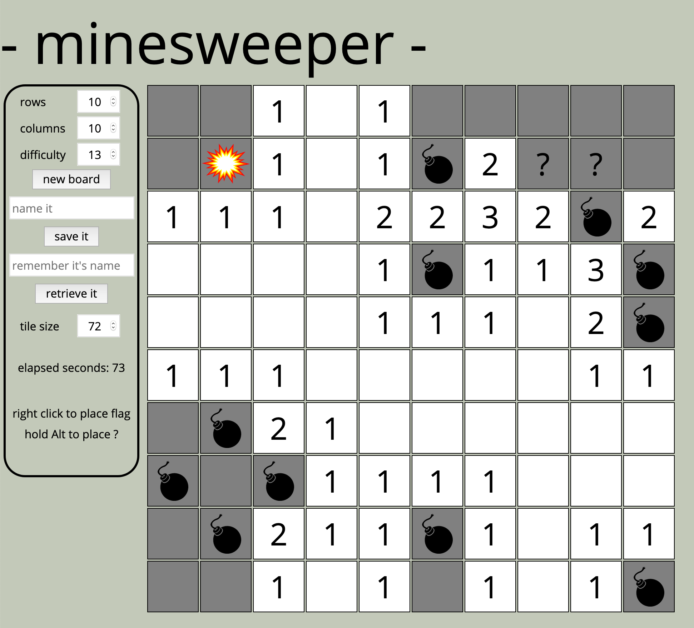

## Minesweeper-react

This is the front-end to https://github.com/martinqueija/minesweeper-typescript

You can visit the game at https://master.d1eyn4tierp0rk.amplifyapp.com/

Bootstrapped from: https://github.com/react-boilerplate/react-boilerplate

`npm install` -> `MINESWEEPER_API_BASE_URL=http://your-backend-uri:8080 npm run start` should make it go.

